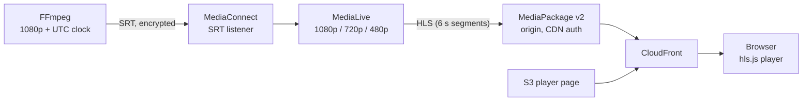

# Live SRT to HLS on AWS

A live-sports-style contribution and distribution pipeline built with Terraform on AWS, operated with a small Python CLI.
An SRT feed (as you would receive from a stadium) goes into AWS, is encoded into an ABR ladder, packaged, delivered through a CDN
and played in a browser, all created and destroyed with a single `terraform apply` and `terraform destroy`.



| Stage | What it does |
|---|---|
| **FFmpeg source** | A test pattern with a burned-in UTC clock, pushed as an encrypted SRT stream (`source/send-srt.sh`). |
| **MediaConnect** | The contribution layer. An SRT listener that accepts only your IP, decrypts with a Terraform-generated passphrase, and shows source thumbnails in the console. |
| **MediaLive** | Encodes the ladder (1080p 5 Mbps, 720p 3 Mbps, 480p 1.5 Mbps, 30 fps, 2 s GOP) and cuts each rendition into 6-second HLS segments. |
| **MediaPackage v2** | The origin. It receives the segments, keeps a rolling live window and serves the manifests and segments only to requests that carry a secret header. |
| **CloudFront** | Caches manifests briefly (2 s) and segments longer (60 s), adds the secret header on the way to the origin, and also serves the player page from a private S3 bucket. |
| **Player** | A static hls.js page that plays the stream and shows the browser clock, the player-reported latency and the current rendition. |

## What this demonstrates

- **Infrastructure as code:** one module per layer, remote state in S3 with native locking, tagging, `terraform fmt` and mocked-provider `terraform test` suites that need no AWS access.
- **Working around provider gaps:** the `hashicorp/aws` provider has no MediaConnect flow and no MediaPackage v2 resources, so those use `hashicorp/awscc` (the whole chain stays declarative).
- **Security:** SRT encryption, an IP allow-list, no public origin (CDN authorization), private buckets with origin access control, no secrets in the repository.
- **Operations:** a Python CLI (`livectl`) with `start`, `stop`, `status` and `check-clean`, tested with `pytest` and `moto`.
- **Cost awareness:** a persistent budget with alerts, a priced estimate ([docs/cost-estimate.md](docs/cost-estimate.md)) and a leftover check.

## Prerequisites

- Terraform 1.11 or newer, and the AWS CLI v2 with credentials for a personal or sandbox account.
- FFmpeg built with SRT support (`ffmpeg -protocols | grep srt`) and the DejaVu Sans font (`fonts-dejavu-core`).
- Python 3.10 or newer with `virtualenv` (`pip install --user virtualenv`).

## Quick start

```bash
# 1. One-time: state bucket and the monthly budget (state stays local and is gitignored)
cd bootstrap
cp terraform.tfvars.example terraform.tfvars      # set alert_email
terraform init && terraform apply
terraform output -raw state_bucket_name           # note the bucket name
cd ..

# 2. Configure the demo environment
cd envs/demo
cp backend.hcl.example backend.hcl                # put the bucket name in
printf 'source_cidr = "%s/32"\n' "$(curl -s https://checkip.amazonaws.com)" > terraform.tfvars
terraform init -backend-config=backend.hcl
terraform apply                                   # a few minutes, CloudFront included
cd ../..

# 3. Install the CLI
python3 -m virtualenv .venv
.venv/bin/pip install -e "tools[dev]"

# 4. Go live
.venv/bin/livectl start                           # flow first, then the channel (about 2 minutes)
SRT_HOST=$(terraform -chdir=envs/demo output -raw ingest_ip) \
SRT_PASSPHRASE=$(aws secretsmanager get-secret-value \
  --secret-id "$(terraform -chdir=envs/demo output -raw passphrase_secret_arn)" \
  --query SecretString --output text) \
  source/send-srt.sh                              # leave running
terraform -chdir=envs/demo output -raw player_url # open this in a browser

# 5. Tear down (do not skip: MediaLive and MediaConnect bill by the hour while running)
.venv/bin/livectl stop
terraform -chdir=envs/demo destroy
.venv/bin/livectl check-clean                     # exits 1 if anything billable is left
```

`livectl` reads the flow ARN and channel ID from `terraform output` by default. If Terraform state is not available, pass them directly:
`livectl stop --flow-arn <arn> --channel-id <id>`.

## Repository layout

```
bootstrap/          one-time root: state bucket and the budget (never destroyed)
modules/
  ingest/           MediaConnect SRT flow, passphrase secret, IP allow-list, thumbnails
  medialive-role/   IAM role that MediaLive assumes
  encode/           MediaLive input and channel; the ABR ladder is a variable
  package/          MediaPackage v2 channel, origin endpoint and CDN authorization
  player/           private S3 bucket with the hls.js page
  delivery/         CloudFront distribution with the two origins
  guardrails/       AWS Budgets alerts
envs/demo/          wires the modules together
tools/livectl/      Python CLI, with tests in tools/tests
source/             FFmpeg SRT source script
scripts/            price lookup for the cost estimate
docs/               design spec, implementation plans, cost estimate
```

## Testing

Everything runs offline with no AWS credentials:

```bash
for m in bootstrap modules/*; do (cd $m && terraform init -backend=false -input=false && terraform test); done
.venv/bin/pytest -q tools
source/send-srt.sh --frame /tmp/clock.png         # renders one frame to check the burned-in clock
```

## Costs

While the demo runs, the priced items come to about **1.74 USD per hour** (about 0.43 for a 15-minute demo) for a single-pipeline
channel. When nothing is running, cost is close to zero. Details, assumptions and what could not be priced are in
[docs/cost-estimate.md](docs/cost-estimate.md). A $25 monthly budget with alerts lives in `bootstrap/`.

## Lessons learned

- **Provider gaps are normal in media services.** MediaConnect and MediaPackage v2 needed the `awscc` provider. MediaPackage v1 has no
  origin endpoint resource at all.
- **Prediction versus test.** I expected MediaLive's plain HLS output to be rejected by MediaPackage v2 (its ingest is normally authorised with
  SigV4). It works, so I ran it before deciding.
- **Small provider traps:** an empty `hls_basic_put_settings {}` block is silently dropped and MediaLive rejects the request;
  MediaConnect rejects an explicit `algorithm` when the key type is `srt-password`.
- **A silent FFmpeg failure.** My first burned-in clock used `%{gmtime\:%H\\\:%M\\\:%S}`; FFmpeg printed `Stray %` and drew nothing, while the stream
  kept running. `%{gmtime\:%T}` works. The lesson is to render one frame locally before going live (`--frame`).
- **A deleted MediaLive channel lingers in `DELETING`.** `livectl check-clean` ignores it, or it would raise a false alarm right after a destroy.
- **Budgets belong outside the environment they watch.** Mine started in the demo and was destroyed with it.
- **IAM is eventually consistent, so dependencies must say so.** A rehearsal from scratch failed with a 403 because the MediaLive input was created before its role's policy existed. The role's `role_arn` output now depends on the policy. Earlier runs had only been lucky.

## Known limitations

- The demo uses one pipeline; `channel_class = "STANDARD"` is a variable but is not exercised.
- The MediaLive role uses broad `Resource = "*"` on a few actions. It is fine for a demo and should be scoped before real use.
- Delivery is MPEG-TS over HLS only.
- The latency figure is approximate: the encoder clock and the browser clock are not synchronised.
- The SRT passphrase is visible in the FFmpeg process arguments on a shared machine, and it is stored in Terraform state
  (the state bucket is private, encrypted and versioned).
- If your public IP changes, update `source_cidr` and re-apply, or the stream is rejected.
- `livectl check-clean` covers the media resources and CloudFront (flows, channels, inputs, channel groups, distributions). It does not look at secrets, IAM roles or S3 buckets; `terraform destroy` removes those, and the README's teardown ends with it.
