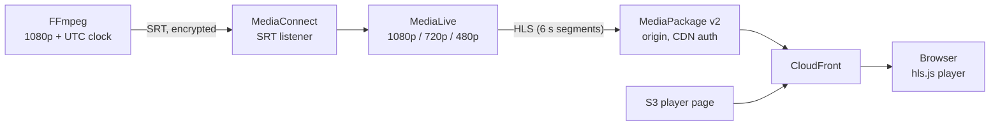

# Live SRT to HLS on AWS

A live-sports-style contribution and distribution pipeline built with Terraform on AWS, operated with a small Python CLI.
An SRT feed (as you would receive from a stadium) goes into AWS, is encoded into an ABR ladder, packaged, delivered through a CDN
and played in a browser, all created and destroyed with a single `terraform apply` and `terraform destroy`.


```mermaid
flowchart LR
    A["FFmpeg<br/>1080p + UTC clock"] -- "SRT, encrypted" --> B["MediaConnect<br/>SRT listener"]
    B --> C["MediaLive<br/>1080p / 720p / 480p"]
    C -- "HLS (6 s segments)" --> D["MediaPackage v2<br/>origin, CDN auth"]
    D --> E["CloudFront"]
    E --> F["Browser<br/>hls.js player"]
    G["S3 player page"] --> E
```

| Stage | What it does |
|---|---|
| **FFmpeg source** | A test pattern with a burned-in UTC clock, pushed as an encrypted SRT stream (`source/send-srt.sh`). |
| **MediaConnect** | The contribution layer. An SRT listener that accepts only your IP, decrypts with a Terraform-generated passphrase, and shows source thumbnails in the console. |
| **MediaLive** | Encodes the ladder (1080p 5 Mbps, 720p 3 Mbps, 480p 1.5 Mbps, 30 fps, 2 s GOP) and cuts each rendition into 6-second HLS segments. |
| **MediaPackage v2** | The origin. It receives the segments, keeps a rolling live window and serves the manifests and segments only to requests that carry a secret header. |
| **CloudFront** | Caches manifests briefly (2 s) and segments longer (60 s), adds the secret header on the way to the origin, and also serves the player page from a private S3 bucket. |
| **Player** | A static hls.js page that plays the stream and shows the browser clock, the player-reported latency and the current rendition. |

## What this demonstrates

- **Infrastructure as code:** one module per layer, remote state in S3 with native locking, tagging, `terraform fmt` and mocked-provider `terraform test` suites that need no AWS access.
- **Working around provider gaps:** the `hashicorp/aws` provider has no MediaConnect flow and no MediaPackage v2 resources, so those use `hashicorp/awscc` (the whole chain stays declarative).
- **Security:** SRT encryption, an IP allow-list, no public origin (CDN authorization), private buckets with origin access control, no secrets in the repository.
- **Operations:** a Python CLI (`livectl`) with `start`, `stop`, `status` and `check-clean`, a browser control center
  that shows every resource in the chain with its logs and runs the test source, and `just` recipes for everything;
  tested with `pytest`, `moto` and browser tests driven through every state.
- **Cost awareness:** a persistent budget with alerts, a priced estimate ([docs/cost-estimate.md](docs/cost-estimate.md)) and a leftover check.

## Prerequisites

With Docker, you need only Docker and an AWS profile: see [Run with Docker](#run-with-docker). Otherwise:

- Terraform 1.11 or newer, and the AWS CLI v2 with credentials for a personal or sandbox account.
- FFmpeg built with SRT support (`ffmpeg -protocols | grep srt`) and the DejaVu Sans font (`fonts-dejavu-core`).
- Python 3.10 or newer with `virtualenv` (`pip install --user virtualenv`).
- [`just`](https://github.com/casey/just) to run the recipes below (`cargo install just`, `brew install just`, or a
  prebuilt binary from the releases page; Ubuntu ships it from 24.04 onwards).

## Run with Docker

One image carries Terraform, Python with `livectl`, FFmpeg and `just` (about 360 MB). Your checkout is mounted into
it, so state and configuration stay in the same files as the host path below, and the two can be mixed.

You need Docker with Compose v2 and an AWS profile in `~/.aws` for an IAM user or role (never the root user). With
the AWS CLI installed, use `aws configure` or `aws configure sso` and `aws sso login` as usual. Without it, run the
same commands from AWS's own image, as yourself so the files stay readable to you and to the console:

```bash
mkdir -p ~/.aws
aws() { docker run --rm -it -u "$(id -u):$(id -g)" -e HOME=/aws -v ~/.aws:/aws/.aws amazon/aws-cli "$@"; }
aws configure sso                                  # or: aws configure (access keys)
aws sso login --profile <name> --use-device-code   # SSO only: again whenever the console says the session expired
```

```bash
git clone https://github.com/wbm99/aws-channel-with-terraform && cd aws-channel-with-terraform
cp .env.example .env                               # set AWS_PROFILE; CONSOLE_PORT if 8765 is taken
printf 'UID=%s\nGID=%s\n' "$(id -u)" "$(id -g)" >> .env   # the container runs as you (bash does not export UID)

# Configuration, as in the quick start below
cp bootstrap/terraform.tfvars.example bootstrap/terraform.tfvars    # set alert_email
cp envs/demo/backend.hcl.example envs/demo/backend.hcl
printf 'source_cidr = "%s/32"\n' "$(curl -s https://checkip.amazonaws.com)" > envs/demo/terraform.tfvars

docker compose run --rm console just bootstrap     # once per AWS account; put the bucket name in backend.hcl
docker compose run --rm console just init          # once per checkout
docker compose up                                  # the console on http://127.0.0.1:8765
```

Everything else (deploy, go live, the test source, tear down, the leftover scan) is in the console. Recipes that
need only Terraform or `livectl` run the same way, for example `docker compose run --rm console just check-clean`
(also `status`, `outputs`, `plan`, `test-tf`). Three do not: `just send` needs the AWS CLI, which the image leaves
out (use *Send test source* in the console); `just ui` inside `run` publishes no port (use `docker compose up`); and
`just test` needs the dev tools, which only CI's test image has.

> **`docker compose down` stops the console, not AWS billing.** Use *Go off air* or *Tear down stack* first, then
> *Scan for leftovers*.

- The console header shows the account and role it acts as, and a banner when credentials are missing, expired or
  belong to the root user.
- The port is published on `127.0.0.1` only, never on the network. Set `CONSOLE_PORT` in `.env` to change it.
- `docker compose up` pulls the image built from `main`. On any other checkout, use `docker compose up --build`:
  `livectl` comes from the image, while the Terraform code comes from your checkout.
- `~/.aws` is mounted read-write, as the AWS CLI uses it: SSO saves refreshed tokens there. After fixing missing or
  rejected credentials, restart the console (`docker compose restart`); an SSO login is picked up without one.
- Run the image through Compose. On its own (`docker run`), it listens on loopback inside the container, so a
  published port reaches nothing; that is deliberate, so a `-p 8765:8765` can never expose it to the network.

## Quick start

Every command is a `just` recipe. `just --list` shows them all, and the [`justfile`](justfile) is the readable source
of what each one runs.

```bash
# 1. One-time: state bucket and the monthly budget (state stays local and is gitignored)
cp bootstrap/terraform.tfvars.example bootstrap/terraform.tfvars    # set alert_email
just bootstrap                                     # prints the state bucket name

# 2. Configure and create the demo environment
cp envs/demo/backend.hcl.example envs/demo/backend.hcl              # put the bucket name in
printf 'source_cidr = "%s/32"\n' "$(curl -s https://checkip.amazonaws.com)" > envs/demo/terraform.tfvars
just venv                                          # .venv with livectl and its dev extras
just init
just up                                            # a few minutes, CloudFront included

# 3. Go live
just start                                         # flow first, then the channel (about 2 minutes)
just send                                          # FFmpeg test pattern; leave it running
                                                   # tune it: FPS=25 SERVICE_NAME="Match 1" just send
just player                                        # the URL to open in a browser

# 4. Tear down (do not skip: MediaLive and MediaConnect bill by the hour while running)
just stop
just down                                          # destroy, then verify nothing billable survived
```

**Without `just`:** every recipe is an ordinary shell command, so read the `justfile` and run them directly. `just send`
is the one worth copying rather than retyping: it reads the ingest address from `terraform output` and the passphrase
from Secrets Manager at the moment of use, so the secret never lands in a file or your shell history. Its settings
(pattern, resolution, frame rate, bitrate, keyframe interval, audio, MPEG-TS service name and program, SRT latency)
are environment variables, listed with their allowed values at the top of `source/send-srt.sh`.

`livectl` reads the flow ARN and channel ID from `terraform output` by default. If Terraform state is not available,
pass them directly: `livectl stop --flow-arn <arn> --channel-id <id>`.

## Operating it

`just ui` serves a control center on <http://127.0.0.1:8765>. It is built on Python's standard library and plain
browser modules, so it adds no dependency to the project.

It has two pages, picked from a side menu, with the same header and pipeline on both:

- **Header:** a one-line verdict for the whole pipeline (*Not deployed*, *Off air*, *On air · playing*,
  *On air · no source*, *Partly on*, …), what is billing per hour right now (summed from the resources that are up),
  and, whenever a job runs, a pill with its name, how long it has run and its latest line. Clicking the pill opens the
  job's output. Two clocks in the middle read UTC (the time burned into the test source, so the gap to the player is
  the glass-to-glass delay) and UTC−3.
- **Pipeline:** one node per resource, left to right: MediaConnect Source (SRT) → MediaConnect Flow → MediaLive Input →
  MediaLive Channel → MediaPackage Channel → CloudFront CDN → Player. Each shows its AWS state, a health colour and a
  key figure. The Player node fetches the playlist through CloudFront and checks that its media sequence advances, the
  only end-to-end proof that viewers get video. Whether the SRT source is connected comes from MediaConnect's Source
  Health events, which arrive within about a second; the `SourceConnected` metric is one to three minutes behind and
  is only the fallback. Clicking a node opens its details in a drawer, with a link to the AWS console.

**Control** is for setting up and tearing down:

- **Steps:** 1 Deploy the stack, 2 Go live, 3 Send a source. Each step ticks off when done, says what is happening
  while its job runs, and holds its own buttons; the next step pulses.

  | Button | Runs |
  |---|---|
  | Deploy stack | `terraform apply` (refused while on air: Terraform cannot update a running channel) |
  | Go live / Go off air | starts the flow, then the channel / stops the test source, the channel, then the flow |
  | Send test source / Stop test source | runs `source/send-srt.sh` against the ingest |

  The source step sums up what Send will push (`Test card · 1080p30 · 6 Mbps · AAC 128k · "livectl test source"`)
  and links to the Source page, where the settings live.

- **Last job:** the output of the latest job, full width, each line with its UTC date and time, with *Show all*.
  A stopwatch and a progress bar show how far it has got: Terraform's own plan gives deploy and teardown an exact
  count (*12 of 31 resources · 39%*), and going live or off air counts the flow and channel reaching their states.
  The bar is blue while the job runs, green when it succeeds and red if it fails; the header pill shows the same.
- **Endpoints:** SRT ingest, player, HLS manifest and the Secrets Manager ARN of the passphrase, each with a Copy
  button that copies exactly the value.
- **Maintenance,** apart from the steps: *Scan for leftovers* and *Tear down stack* (`terraform destroy`, after you
  type `destroy`; refused while on air).

**Source** tunes the FFmpeg test source:

- **Settings** in four groups, every value inside the channel's input class (H.264, HD, up to 10 Mbps):
  - *Video:* pattern (test card, SMPTE HD bars, PAL/EBU bars, black, "Please stand by", all with the UTC clock
    burned in), 720p or 1080p, 25/30/50/60 fps (the channel outputs 30, so 25 and 50 show frame-rate conversion),
    0.5-10 Mbps, keyframe interval;
  - *Audio:* AAC, MP2 or AC-3, bitrate, a 440 Hz or 1 kHz tone or silence;
  - *MPEG-TS:* service name, provider, program number;
  - *SRT:* latency.
- **Edit, then Apply.** Changed fields are marked, and one *Apply N changes* restarts FFmpeg once with all of them:
  viewers see a few seconds of MediaLive's slate while SRT reconnects. MediaConnect may still hold the old SRT
  connection for a few seconds, so a reconnect it refuses is retried after 1, 2, 4 and 8 s (the log shows *SRT
  connection refused; trying again*). While the source is stopped the same button reads *Send test source*. The settings last as long as the console process.
- **Sent vs received** puts what FFmpeg is sending next to what MediaConnect parsed from the stream
  (`DescribeFlowSourceMetadata`: codecs, resolution, frame rate, channels, and the program name, which MediaConnect
  takes from the SDT service name). A row that disagrees is highlighted.
- **Send from your own encoder** gives OBS, vMix or a hardware encoder what it needs to replace the test source: the
  SRT address, the passphrase (hidden until *Show*) and one `srt://` URL carrying caller mode, AES-256
  (`pbkeylen=32`), packet size and the latency set above, in microseconds as FFmpeg and OBS read it. In OBS:
  *Settings → Stream*, Service *Custom…*, the URL as the Server, Stream Key empty. MediaConnect takes one sender, so
  stop the test source first. The console reads the passphrase from Secrets Manager on each *Show* or *Copy*, never
  in the regular refresh, and gives it only to a page opened at `127.0.0.1` or `localhost` (a page served under
  another name that points at 127.0.0.1, DNS rebinding, gets a 403).

**Live** is for watching the broadcast:

- **Player:** the deployed hls.js page in embed mode (`?embed=1`: the video alone, 16:9), with a YouTube-style
  badge: a red **LIVE** at the live edge, a grey **Go live** when paused or more than a segment behind, which jumps
  back to the edge. Chrome pauses muted video that stops being visible (another tab, or the console showing another
  page) and resumes it from where it stopped, minutes behind; the player notices and jumps back to live. A pause you
  make yourself is left alone. The page retries when the
  playlist is still a 404 before the first segment, so a player opened before going live starts on its own. The *Live*
  menu item pulses once the stream plays.
- **Figures** under it (a dash for a resource that is off, rather than its last stale datapoint): source bitrate, round trip, unrecovered packets, input frame rate, active alerts, ingest into
  MediaPackage and CloudFront requests, with *Stop test source* and *Go off air* so billing can be ended from here.
- **Logs,** one tab per resource, full width under the player, newest line first, each with its UTC date and time.
  *Expand* opens them as their own **Logs** page (also in the menu), full height, with a filter. The CloudFront and
  MediaPackage tabs show their CloudWatch figures (requests, delivered Mbps, error rates; ingest and egress). MediaLive and MediaConnect events (state
  changes, alerts, SRT source health with its TR 101 290 flags) reach a log group through an EventBridge rule
  (`modules/observability`); MediaLive's own encoder and as-run logs are read from `ElementalMediaLive`; the SRT
  Source tab also shows the test source's output. MediaPackage and CloudFront access logs are not enabled; their
  figures are in the node details.

It is deliberately blunt about its limits:

- **Loopback only.** It refuses any address that is not `127.0.0.1`, `localhost` or `::1`, because it can destroy
  infrastructure. There is no authentication and it is not meant to be exposed.
- **The server enforces the rules, not only the page.** Hidden buttons are a convenience; a direct API call to tear
  down while on air, or without the typed word, is refused the same way.
- **One operation at a time.** A second request while a job is running is refused rather than queued.
- **The test source's passphrase** is read from Secrets Manager when you click *Send test source*, handed to FFmpeg in
  its environment, and replaced by `***` in every output line before the console stores it. Closing the console stops
  the source.
- **Survives a dropped network.** AWS calls time out in seconds, the last good data stays on screen with a note saying
  how old it is, and the page reconnects by itself.
- **Cheap to watch.** AWS state is cached for 5 s and CloudWatch metrics are read in one call a minute, so an open page
  polling every 2 s costs almost nothing.
- Terraform runs with `-input=false`, so it can never stall on a prompt nobody can see.

To see every state without an AWS account, `just ui-scenario <name>` serves the console against stub clients
(`not-deployed`, `off-air`, `on-air-playing`, `on-air-no-source`, `partly-on`, … listed in `tools/tests/scenarios.py`).

### Verify the console live (costs money: about 1.74 USD/hour while on air)

Offline tests prove the console's logic, not AWS's answers. After `just up` (re-run it once on an existing stack so
the new outputs exist), open `just ui` and check:

1. Every node shows a state; none says "not in the Terraform outputs yet".
2. **Go live**: the verdict goes *Going live…* then *On air · no source*; the cost shows about $1.49 / h.
3. **Send test source**: within seconds the SRT node reads *connected* (its details say *state from MediaConnect
   event*), the verdict *On air · playing* follows once segments reach CloudFront, and the player shows the
   burned-in clock. Stop the source and the node turns *not connected* within seconds as well.
4. The **MediaLive** tab shows channel state events (proves the EventBridge rule and the log resource policy) and
   encoder log lines (the `ElementalMediaLive` streams are named after the channel ARN with `_` for `:`, confirmed
   in the first live run).
5. The **Source (SRT)** tab shows FFmpeg output with `passphrase=***`.
6. The **CloudFront** node shows requests per minute (proves the metric dimensions).
7. Stop the test source while on air: the channel node lists an input-loss alert (proves `list_alerts` with
   `StateFilter=SET`), and the player turns black.
8. Each *Open in the AWS console* link opens the right page.
9. **Go off air**: the source stops first, then channel and flow; the verdict reads *Off air* and the cost $0.00.
10. **Tear down**, then **Scan for leftovers**: nothing billable, and `ElementalMediaLive` listed as information.
11. **With Docker:** `docker compose run --rm console just bootstrap` and `just init` on a fresh checkout, then steps
    1-10 from `docker compose up` with an SSO profile. The header names the role and account.
12. **With Docker and SSO:** leave the console running across the SSO access-token refresh (about an hour): the
    header keeps the role, no node shows a token error, and a Deploy started after the refresh succeeds.
13. **Apply while playing** (Apply sometimes left the source stopped, likely because MediaConnect refused the new
    SRT connection while it still held the old one): change two settings on the Source page and Apply, ten times.
    The source ends up sending every time, the log shows any *trying again* lines, and FFmpeg never reads *exited*.
    Note what the player, the slate, the SRT node and the next-step hint each do, and how long until the player shows
    the new picture without a reload.
14. Set 25 fps, then 50 fps: both play, and the channel node still reads *input* at the new rate while the output
    stays 30 fps.
15. Send MP2, then AC-3 audio: the player still has sound (MediaLive re-encodes to AAC).
16. Set a service name: within seconds *Sent vs received* shows it as MediaConnect's program name, and no row is
    highlighted once the restart has settled.
17. **From OBS:** stop the test source, copy the URL from *Send from your own encoder* into OBS (*Settings → Stream*,
    Service *Custom…*) and start streaming. The SRT node turns connected and the player shows the OBS picture.

## Repository layout

```
AGENTS.md           conventions and cost rules for agents working here (CLAUDE.md symlinks to it)
justfile            every command in the project; `just --list` to see them
compose.yaml        the console in Docker; docker/Dockerfile builds the image, .env.example lists the settings
.github/workflows/  CI: tests on every pull request, image published to GHCR on merge to main
bootstrap/          one-time root: state bucket and the budget (never destroyed)
modules/
  ingest/           MediaConnect SRT flow, passphrase secret, IP allow-list, thumbnails
  medialive-role/   IAM role that MediaLive assumes
  encode/           MediaLive input and channel; the ABR ladder is a variable
  package/          MediaPackage v2 channel, origin endpoint and CDN authorization
  player/           private S3 bucket with the hls.js page
  delivery/         CloudFront distribution with the two origins
  guardrails/       AWS Budgets alerts
  observability/    EventBridge rule and log group for MediaLive and MediaConnect events
envs/demo/          wires the modules together
tools/livectl/      Python CLI and the browser console (site/), with tests in tools/tests
source/             FFmpeg SRT source script
scripts/            price lookup for the cost estimate
docs/               cost estimate and study notes; the spec and plans live under docs/superpowers/
```

## Testing

Everything runs offline with no AWS credentials:

```bash
just test          # terraform test for every root (mocked providers), then pytest over tools (moto)
just test-ui       # drive the console in Chrome through every scenario (pip install -e "tools[dev,ui]")
just validate      # formatting check and terraform validate for every root
just frame         # renders one frame to /tmp/clock.png to check the burned-in clock
```

CI (`.github/workflows/image.yml`) runs the same suite on every pull request and publishes the image to GHCR on each
merge to `main`, as `ghcr.io/wbm99/aws-channel-with-terraform` (public, like the repository). If a fork's package
comes out private, make it public in the package's *Package settings*, or `docker compose up` builds locally instead.

## Costs

While the demo runs, the priced items come to about **1.74 USD per hour** (about 0.43 for a 15-minute demo) for a single-pipeline
channel. When nothing is running, cost is close to zero. Details, assumptions and what could not be priced are in
[docs/cost-estimate.md](docs/cost-estimate.md). A $25 monthly budget with alerts lives in `bootstrap/`.

## Lessons learned

- **Provider gaps are normal in media services.** MediaConnect and MediaPackage v2 needed the `awscc` provider. MediaPackage v1 has no
  origin endpoint resource at all.
- **Prediction versus test.** I expected MediaLive's plain HLS output to be rejected by MediaPackage v2 (its ingest is normally authorised with
  SigV4). It works, so I ran it before deciding.
- **Small provider traps:** an empty `hls_basic_put_settings {}` block is silently dropped and MediaLive rejects the request;
  MediaConnect rejects an explicit `algorithm` when the key type is `srt-password`.
- **A silent FFmpeg failure.** My first burned-in clock used `%{gmtime\:%H\\\:%M\\\:%S}`; FFmpeg printed `Stray %` and drew nothing, while the stream
  kept running. `%{gmtime\:%T}` works. The lesson is to render one frame locally before going live (`--frame`).
- **A deleted MediaLive channel lingers in `DELETING`.** `livectl check-clean` ignores it, or it would raise a false alarm right after a destroy.
- **Budgets belong outside the environment they watch.** Mine started in the demo and was destroyed with it.
- **Never act on an in-between state.** Stopping the channel makes MediaConnect update the flow for a few seconds
  (ACTIVE → UPDATING → ACTIVE). My stop logic checked during that window, saw UPDATING, never sent `stop_flow`, and
  waited ten minutes for STANDBY while the flow kept billing. `livectl` now waits for each resource to settle before
  deciding what to do, and logs every state it passes through.
- **Metrics are for trends, events are for state.** The console first read "is the source connected?" from the
  `SourceConnected` metric, so a stopped source still showed as connected minutes later. MediaConnect's Source Health
  event had said so within a second.
- **IAM is eventually consistent, so dependencies must say so.** A rehearsal from scratch failed with a 403 because the MediaLive input was created before its role's policy existed. The role's `role_arn` output now depends on the policy. Earlier runs had only been lucky.

## Known limitations

- The demo uses one pipeline; `channel_class = "STANDARD"` is a variable but is not exercised.
- The MediaLive role uses broad `Resource = "*"` on a few actions. It is fine for a demo and should be scoped before real use.
- Delivery is MPEG-TS over HLS only.
- The latency figure is approximate: the encoder clock and the browser clock are not synchronised.
- The SRT passphrase is visible in the FFmpeg process arguments on a shared machine, whether the source runs from
  `just send` or from the console (FFmpeg takes it inside its SRT URL), and it is stored in Terraform state (the state
  bucket is private, encrypted and versioned).
- If your public IP changes, update `source_cidr` and re-apply, or the stream is rejected.
- The browser console has no authentication. It binds to loopback only and refuses anything else, but anyone with an
  account on the same machine can reach it, and its apply and destroy run with `-auto-approve`. In Docker it listens on
  every interface inside the container, and Compose publishes it on the host's loopback only.
- Docker on native Windows (without WSL) is not supported: the bind mounts and `${HOME}` behave differently there.
- MediaLive creates the `ElementalMediaLive` log group itself, so it outlives `terraform destroy`. The leftover scan
  lists it as information (log storage only, not billed by the hour).
- `livectl check-clean` covers the media resources and CloudFront (flows, channels, inputs, channel groups, distributions). It does not look at secrets, IAM roles or S3 buckets; `terraform destroy` removes those, and the README's teardown ends with it.
